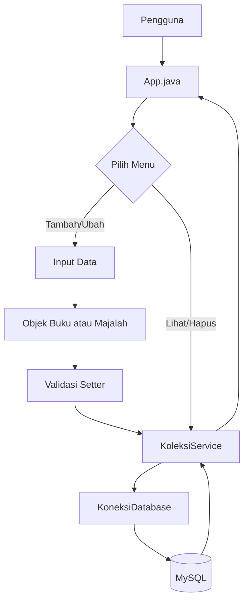

<div align="center">

https://docs.google.com/document/d/132V1YRrJYhQIRpGMSYi1To0qPdAEz8gJokb_hBk6zFY/edit?usp=drivesdk

# 📚 Penjelasan Detail Program Sistem Pengelolaan Koleksi Perpustakaan

**Java CLI • MySQL • CRUD • OOP • Custom Exception**

Dokumen ini menjelaskan struktur, alur kerja, dan konsep OOP pada program pengelolaan koleksi perpustakaan secara bertahap dan mudah dipahami.

</div>

---

> [!NOTE]
> Dokumen ini disusun sebagai laporan penjelasan kode. Fokus utamanya adalah memahami **mengapa setiap class dibuat**, **bagaimana data mengalir**, dan **bagaimana validasi serta CRUD bekerja** jadi jangan berpikir bahwa stuktur programnya harus seperti ini untuk mencapai nilai sempurna karena pada dasarnya ini hanya sebagai **contoh** struktur programnya seperti ini karena memang bawaan dari IDE yang dipakai saat program dibuat. **semua kode program ada di dalam src**.


## 📌 Ringkasan Cepat

| Aspek | Keterangan |
|---|---|
| Jenis aplikasi | Java CLI |
| Database | MySQL |
| Fitur utama | Tambah, lihat, ubah, hapus koleksi |
| Jenis koleksi | Buku dan Majalah |
| Konsep OOP | Abstract class, inheritance, encapsulation, polymorphism, interface |
| Validasi data | Diterapkan melalui setter |
| Penanganan error | Menggunakan custom exception |

## 🧭 Daftar Isi

1. Gambaran umum program  
2. Struktur file program  
3. Database MySQL  
4. File exception  
5. Koneksi database  
6. Abstract class `Koleksi`  
7. Class `Buku`  
8. Class `Majalah`  
9. Interface `CrudService`  
10. Class `KoleksiService`  
11. Method CRUD di service  
12. Class `App`  
13. Alur tambah, lihat, ubah, dan hapus  
14. Penerapan konsep OOP  
15. Kesimpulan  

## 🗺️ Peta Alur Sistem



<details>
<summary><strong>Tips membaca laporan ini</strong></summary>

Baca bagian ini secara berurutan dari atas ke bawah. Mulailah dari gambaran umum, lalu pahami model OOP (`Koleksi`, `Buku`, `Majalah`), setelah itu masuk ke bagian database dan service. Bagian `App.java` paling mudah dipahami setelah alur CRUD sudah jelas.

</details>

---

## 🧭 1. Gambaran Umum Program

Program ini adalah sistem sederhana berbasis **Java CLI** dan **MySQL** untuk mengelola data koleksi perpustakaan.

Fitur utama program adalah:

1. Menambah koleksi.
2. Melihat koleksi.
3. Mengubah koleksi.
4. Menghapus koleksi.
5. Keluar dari program.

Jenis koleksi yang dikelola adalah:

1. Buku.
2. Majalah.

Program ini menggunakan beberapa konsep Pemrograman Berorientasi Objek, yaitu:

1. `abstract class`
2. `inheritance`
3. `encapsulation`
4. `interface`
5. `custom exception`
6. `polymorphism`

Secara sederhana, alur program dapat digambarkan seperti berikut:

```text
Pengguna
   ↓
App.java
   ↓
Objek Koleksi, Buku, atau Majalah
   ↓
Validasi melalui setter
   ↓
KoleksiService
   ↓
KoneksiDatabase
   ↓
Database MySQL
```

---

## 🗂️ 2. Struktur File Program

Program dibagi menjadi beberapa file agar setiap bagian memiliki tanggung jawab masing-masing.

```text
App.java
KoneksiDatabase.java
Koleksi.java
Buku.java
Majalah.java
CrudService.java
KoleksiService.java
DataKoleksiTidakValidException.java
KoleksiTidakDitemukanException.java
KoneksiDatabaseException.java
```

| File | Tugas |
|---|---|
| `App.java` | Menampilkan menu dan menerima input pengguna |
| `KoneksiDatabase.java` | Mengatur koneksi Java ke MySQL |
| `Koleksi.java` | Abstract class untuk data umum koleksi |
| `Buku.java` | Class turunan untuk koleksi buku |
| `Majalah.java` | Class turunan untuk koleksi majalah |
| `CrudService.java` | Interface berisi rancangan operasi CRUD |
| `KoleksiService.java` | Menjalankan CRUD ke database |
| `DataKoleksiTidakValidException.java` | Error khusus untuk data tidak valid |
| `KoleksiTidakDitemukanException.java` | Error khusus jika data tidak ditemukan |
| `KoneksiDatabaseException.java` | Error khusus jika database bermasalah |

Pembagian file ini membuat program lebih rapi. Misalnya, `App.java` hanya fokus pada menu dan input, sedangkan `KoleksiService.java` fokus pada proses database.

---

## 🗄️ 3. Database MySQL

### 3.1 Membuat Database

```sql
CREATE DATABASE perpustakaan_db;
```

Perintah ini digunakan untuk membuat database bernama `perpustakaan_db`.

---

### 3.2 Memilih Database

```sql
USE perpustakaan_db;
```

Perintah ini digunakan agar database `perpustakaan_db` menjadi database aktif yang akan digunakan.

---

### 3.3 Membuat Tabel Koleksi

```sql
CREATE TABLE koleksi (
    id INT AUTO_INCREMENT PRIMARY KEY,
    judul VARCHAR(100) NOT NULL,
    tahun_terbit INT NOT NULL,
    jumlah_stok INT NOT NULL,
    jenis VARCHAR(30) NOT NULL,
    penulis VARCHAR(100),
    penerbit VARCHAR(100),
    isbn VARCHAR(50),
    edisi VARCHAR(50),
    bulan_terbit VARCHAR(50),
    kategori VARCHAR(100)
);
```

Penjelasan kolom:

| Kolom | Fungsi |
|---|---|
| `id` | Nomor unik setiap koleksi |
| `judul` | Judul buku atau majalah |
| `tahun_terbit` | Tahun terbit koleksi |
| `jumlah_stok` | Jumlah stok koleksi |
| `jenis` | Menentukan apakah data berupa `BUKU` atau `MAJALAH` |
| `penulis` | Khusus buku |
| `penerbit` | Khusus buku |
| `isbn` | Khusus buku |
| `edisi` | Khusus majalah |
| `bulan_terbit` | Khusus majalah |
| `kategori` | Khusus majalah |

Program memakai **satu tabel** untuk dua jenis koleksi. Kolom `jenis` digunakan sebagai penanda apakah data tersebut merupakan buku atau majalah.

Jika data adalah buku, maka kolom `penulis`, `penerbit`, dan `isbn` akan digunakan. Kolom `edisi`, `bulan_terbit`, dan `kategori` akan bernilai `null`.

Jika data adalah majalah, maka kolom `edisi`, `bulan_terbit`, dan `kategori` akan digunakan. Kolom `penulis`, `penerbit`, dan `isbn` akan bernilai `null`.

---

## ⚠️ 4. File Exception

Program memakai tiga custom exception agar pesan kesalahan lebih jelas dan sesuai dengan kebutuhan soal.

---

### 4.1 `DataKoleksiTidakValidException.java`

```java
public class DataKoleksiTidakValidException extends Exception {
    public DataKoleksiTidakValidException(String pesan) {
        super(pesan);
    }
}
```

Class ini digunakan ketika data koleksi tidak sesuai aturan bisnis.

Contoh kondisi yang menyebabkan exception ini muncul:

1. Judul kosong.
2. Tahun terbit kurang dari atau sama dengan nol.
3. Jumlah stok negatif.
4. Penulis buku kosong.
5. Edisi majalah kosong.
6. Jenis koleksi tidak sesuai.

`extends Exception` menunjukkan bahwa class ini adalah exception buatan sendiri.

`super(pesan)` digunakan untuk mengirim pesan error ke class induk `Exception`.

Contoh penggunaan:

```java
throw new DataKoleksiTidakValidException("Judul koleksi tidak boleh kosong.");
```

Artinya, program menghentikan proses pembuatan atau perubahan data karena data tidak valid.

---

### 4.2 `KoleksiTidakDitemukanException.java`

```java
public class KoleksiTidakDitemukanException extends Exception {
    public KoleksiTidakDitemukanException(String pesan) {
        super(pesan);
    }
}
```

Exception ini digunakan ketika koleksi tidak ditemukan di database.

Biasanya exception ini muncul saat proses:

1. Mengubah koleksi.
2. Menghapus koleksi.

Sebelum data diubah atau dihapus, program harus memastikan bahwa ID koleksi memang tersedia di database.

Contoh penggunaan:

```java
throw new KoleksiTidakDitemukanException(
        "Koleksi dengan ID " + id + " tidak ditemukan."
);
```

Jika ID tidak ada, program tidak akan melanjutkan proses ubah atau hapus.

---

### 4.3 `KoneksiDatabaseException.java`

```java
public class KoneksiDatabaseException extends Exception {
    public KoneksiDatabaseException(String pesan) {
        super(pesan);
    }
}
```

Exception ini digunakan ketika terjadi masalah pada database.

Contohnya:

1. Driver MySQL tidak ditemukan.
2. Username atau password salah.
3. Database belum dibuat.
4. Tabel belum dibuat.
5. Query SQL gagal dijalankan.

Dengan exception ini, pesan error menjadi lebih jelas bagi pengguna program.

---

## 🔌 5. File `KoneksiDatabase.java`

File ini bertugas menghubungkan program Java dengan database MySQL.

---

### 5.1 Import Library SQL

```java
import java.sql.Connection;
import java.sql.DriverManager;
import java.sql.SQLException;
```

Penjelasan:

1. `Connection` digunakan untuk menyimpan koneksi ke database.
2. `DriverManager` digunakan untuk membuat koneksi.
3. `SQLException` digunakan untuk menangani error yang berhubungan dengan SQL atau database.

Tanpa import ini, Java tidak mengenali class yang digunakan untuk koneksi database.

---

### 5.2 Deklarasi Class

```java
public class KoneksiDatabase {
```

Class ini dibuat khusus untuk menangani koneksi database. Dengan adanya class ini, kode koneksi tidak perlu ditulis berulang-ulang di file lain.

---

### 5.3 Variabel Koneksi Database

```java
public static String urlDatabase = "jdbc:mysql://localhost:3306/";
public static String username = "root";
public static String password = "";
public static String namaDatabase = "perpustakaan_db";
public static String driverDatabase = "com.mysql.cj.jdbc.Driver";
```

Penjelasan:

1. `urlDatabase` adalah alamat database MySQL.
2. `localhost` berarti database berada di komputer sendiri.
3. `3306` adalah port default MySQL.
4. `username` adalah nama pengguna MySQL.
5. `password` adalah password MySQL.
6. `namaDatabase` adalah nama database yang digunakan.
7. `driverDatabase` adalah driver MySQL yang digunakan Java.

Variabel dibuat `static` agar dapat dipanggil langsung melalui nama class tanpa harus membuat objek `KoneksiDatabase`.

---

### 5.4 Method `getConnection()`

```java
public static Connection getConnection() throws KoneksiDatabaseException {
```

Method ini digunakan untuk membuat koneksi ke database.

Tipe kembalian method ini adalah `Connection`, sehingga ketika berhasil, method ini akan mengembalikan objek koneksi database.

Bagian `throws KoneksiDatabaseException` berarti method ini dapat melempar exception jika koneksi database gagal.

---

### 5.5 Memuat Driver Database

```java
Class.forName(driverDatabase);
```

Baris ini digunakan untuk memanggil driver MySQL.

Driver diperlukan agar program Java dapat berkomunikasi dengan database MySQL. Jika driver tidak ditemukan, program akan masuk ke bagian `catch ClassNotFoundException`.

---

### 5.6 Membuat Koneksi

```java
return DriverManager.getConnection(
        urlDatabase + namaDatabase,
        username,
        password
);
```

Baris ini digunakan untuk membuat koneksi ke MySQL.

Alamat lengkap database menjadi:

```text
jdbc:mysql://localhost:3306/perpustakaan_db
```

Jika koneksi berhasil, method akan mengembalikan objek `Connection`.

---

### 5.7 Menangani Driver Tidak Ditemukan

```java
} catch (ClassNotFoundException e) {
    throw new KoneksiDatabaseException("Driver database tidak ditemukan.");
}
```

Bagian ini dijalankan jika driver database tidak ditemukan.

Misalnya, library MySQL Connector/J belum ditambahkan ke project.

---

### 5.8 Menangani Koneksi Gagal

```java
} catch (SQLException e) {
    throw new KoneksiDatabaseException("Koneksi database gagal: " + e.getMessage());
}
```

Bagian ini dijalankan jika koneksi ke MySQL gagal.

Contoh penyebabnya:

1. MySQL belum berjalan.
2. Database belum dibuat.
3. Username salah.
4. Password salah.
5. Port database berbeda.

---

## 🏛️ 6. File `Koleksi.java`

File ini adalah class induk untuk semua jenis koleksi.

---

### 6.1 Deklarasi Abstract Class

```java
public abstract class Koleksi {
```

`Koleksi` dibuat sebagai `abstract class` karena class ini hanya berperan sebagai gambaran umum dari semua koleksi.

Objek langsung dari `Koleksi` tidak dibuat. Objek yang dibuat adalah objek dari class turunannya, yaitu `Buku` dan `Majalah`.

Dengan menggunakan abstract class, data umum seperti `id`, `judul`, `tahunTerbit`, dan `jumlahStok` tidak perlu ditulis ulang di class `Buku` dan `Majalah`.

---

### 6.2 Atribut Private

```java
private int id;
private String judul;
private int tahunTerbit;
private int jumlahStok;
```

Atribut dibuat `private` agar tidak bisa diakses langsung dari luar class.

Ini adalah penerapan konsep **encapsulation**.

Data hanya dapat diakses atau diubah melalui method getter dan setter.

Tujuannya agar setiap perubahan data dapat dikontrol. Misalnya, tahun terbit tidak boleh diisi angka negatif, maka pengecekan dilakukan di setter.

---

### 6.3 Constructor untuk Data Baru

```java
public Koleksi(String judul, int tahunTerbit, int jumlahStok)
        throws DataKoleksiTidakValidException {
    setJudul(judul);
    setTahunTerbit(tahunTerbit);
    setJumlahStok(jumlahStok);
}
```

Constructor ini digunakan saat membuat objek baru sebelum disimpan ke database.

Data tidak langsung dimasukkan ke atribut, tetapi lewat setter:

1. `setJudul(judul)`
2. `setTahunTerbit(tahunTerbit)`
3. `setJumlahStok(jumlahStok)`

Tujuannya agar validasi aturan bisnis langsung berjalan.

Jika data tidak valid, objek tidak akan berhasil dibuat.

---

### 6.4 Constructor untuk Data dari Database

```java
public Koleksi(int id, String judul, int tahunTerbit, int jumlahStok)
        throws DataKoleksiTidakValidException {
    this.id = id;
    setJudul(judul);
    setTahunTerbit(tahunTerbit);
    setJumlahStok(jumlahStok);
}
```

Constructor ini digunakan ketika program membaca data dari database.

Perbedaannya dengan constructor sebelumnya adalah constructor ini memiliki parameter `id`.

`id` berasal dari database, sedangkan data lain tetap dimasukkan melalui setter agar tetap melewati validasi.

---

### 6.5 Getter dan Setter ID

```java
public int getId() {
    return id;
}

public void setId(int id) {
    this.id = id;
}
```

`getId()` digunakan untuk mengambil nilai ID.

`setId()` digunakan untuk mengisi atau mengubah ID.

Pada program ini, ID biasanya berasal dari database karena kolom `id` menggunakan `AUTO_INCREMENT`.

---

### 6.6 Getter Judul

```java
public String getJudul() {
    return judul;
}
```

Method ini digunakan untuk mengambil nilai judul.

Karena atribut `judul` bersifat `private`, class lain tidak bisa mengambilnya secara langsung. Maka diperlukan getter.

---

### 6.7 Setter Judul

```java
public void setJudul(String judul) throws DataKoleksiTidakValidException {
    if (judul == null || judul.trim().isEmpty()) {
        throw new DataKoleksiTidakValidException("Judul koleksi tidak boleh kosong.");
    }

    this.judul = judul;
}
```

Setter ini menerapkan aturan bisnis bahwa judul tidak boleh kosong.

Penjelasan kondisi:

1. `judul == null` berarti judul tidak memiliki nilai.
2. `judul.trim().isEmpty()` berarti judul kosong atau hanya berisi spasi.
3. Jika salah satu kondisi benar, program melempar `DataKoleksiTidakValidException`.

`trim()` digunakan untuk menghapus spasi di awal dan akhir teks. Jadi jika pengguna hanya memasukkan spasi, data tetap dianggap kosong.

Jika data valid, nilai judul disimpan melalui:

```java
this.judul = judul;
```

---

### 6.8 Getter Tahun Terbit

```java
public int getTahunTerbit() {
    return tahunTerbit;
}
```

Method ini digunakan untuk mengambil nilai tahun terbit.

---

### 6.9 Setter Tahun Terbit

```java
public void setTahunTerbit(int tahunTerbit) throws DataKoleksiTidakValidException {
    if (tahunTerbit <= 0) {
        throw new DataKoleksiTidakValidException("Tahun terbit harus lebih dari nol.");
    }

    this.tahunTerbit = tahunTerbit;
}
```

Setter ini memastikan tahun terbit harus lebih dari nol.

Contoh data tidak valid:

```text
0
-2020
```

Jika tahun terbit tidak valid, program akan melempar `DataKoleksiTidakValidException`.

---

### 6.10 Getter Jumlah Stok

```java
public int getJumlahStok() {
    return jumlahStok;
}
```

Method ini digunakan untuk mengambil nilai jumlah stok.

---

### 6.11 Setter Jumlah Stok

```java
public void setJumlahStok(int jumlahStok) throws DataKoleksiTidakValidException {
    if (jumlahStok < 0) {
        throw new DataKoleksiTidakValidException("Jumlah stok tidak boleh bernilai negatif.");
    }

    this.jumlahStok = jumlahStok;
}
```

Setter ini memastikan jumlah stok tidak boleh negatif.

Stok bernilai `0` masih diperbolehkan karena bisa saja koleksi sedang kosong.

Contoh data tidak valid:

```text
-1
-5
-100
```

---

### 6.12 Method Abstract

```java
public abstract String getJenis();

public abstract void tampilkanInfo();
```

Kedua method ini wajib dibuat ulang oleh class turunan.

`getJenis()` digunakan untuk mengetahui jenis koleksi.

Pada class `Buku`, method ini mengembalikan:

```java
return "BUKU";
```

Pada class `Majalah`, method ini mengembalikan:

```java
return "MAJALAH";
```

`tampilkanInfo()` digunakan untuk menampilkan data koleksi ke layar. Karena informasi buku dan majalah berbeda, isi method ini juga berbeda di setiap class turunan.

---

## 📘 7. File `Buku.java`

File ini merepresentasikan koleksi berjenis buku.

---

### 7.1 Deklarasi Class dengan Inheritance

```java
public class Buku extends Koleksi {
```

`Buku` adalah turunan dari `Koleksi`.

Artinya, `Buku` mewarisi atribut dan method umum dari `Koleksi`.

Data umum yang diwarisi adalah:

1. `id`
2. `judul`
3. `tahunTerbit`
4. `jumlahStok`

Dengan inheritance, kode menjadi lebih ringkas karena atribut umum tidak perlu ditulis ulang di `Buku`.

---

### 7.2 Atribut Khusus Buku

```java
private String penulis;
private String penerbit;
private String isbn;
```

Atribut ini hanya dimiliki oleh buku.

Penjelasan:

1. `penulis` menyimpan nama penulis buku.
2. `penerbit` menyimpan nama penerbit buku.
3. `isbn` menyimpan kode ISBN buku.

Atribut dibuat `private` agar tetap menerapkan encapsulation.

---

### 7.3 Constructor Buku Baru

```java
public Buku(String judul, int tahunTerbit, int jumlahStok,
            String penulis, String penerbit, String isbn)
        throws DataKoleksiTidakValidException {
    super(judul, tahunTerbit, jumlahStok);
    setDetailBuku(penulis, penerbit, isbn);
}
```

Constructor ini digunakan saat pengguna menambah data buku baru.

Bagian penting:

```java
super(judul, tahunTerbit, jumlahStok);
```

Baris ini memanggil constructor milik class `Koleksi`.

Artinya, sebelum detail buku diproses, data umum seperti judul, tahun terbit, dan jumlah stok akan divalidasi terlebih dahulu di class induk.

Setelah itu, data khusus buku divalidasi melalui:

```java
setDetailBuku(penulis, penerbit, isbn);
```

Urutan validasinya adalah:

```text
judul
tahun terbit
jumlah stok
penulis, penerbit, isbn
```

---

### 7.4 Constructor Buku dari Database

```java
public Buku(int id, String judul, int tahunTerbit, int jumlahStok,
            String penulis, String penerbit, String isbn)
        throws DataKoleksiTidakValidException {
    super(id, judul, tahunTerbit, jumlahStok);
    setDetailBuku(penulis, penerbit, isbn);
}
```

Constructor ini digunakan saat program membaca data buku dari database.

Perbedaannya adalah constructor ini memiliki parameter `id`.

ID berasal dari database. Data lainnya tetap melewati validasi.

---

### 7.5 Method `setDetailBuku()`

```java
public void setDetailBuku(String penulis, String penerbit, String isbn)
        throws DataKoleksiTidakValidException {
```

Method ini digunakan untuk mengisi data khusus buku.

Selain mengisi data, method ini juga menerapkan aturan bisnis khusus untuk buku.

---

### 7.6 Mengecek Data Kosong

```java
boolean penulisKosong = penulis == null || penulis.trim().isEmpty();
boolean penerbitKosong = penerbit == null || penerbit.trim().isEmpty();
boolean isbnKosong = isbn == null || isbn.trim().isEmpty();
```

Tiga variabel boolean ini digunakan untuk memeriksa apakah data buku kosong.

Data dianggap kosong jika:

1. Nilainya `null`.
2. Berisi string kosong.
3. Hanya berisi spasi.

Dengan menggunakan variabel boolean, kondisi validasi menjadi lebih mudah dibaca.

---

### 7.7 Validasi Minimal Informasi Buku

```java
if (penulisKosong && penerbitKosong && isbnKosong) {
    throw new DataKoleksiTidakValidException(
            "Buku harus memiliki informasi penulis, penerbit, atau ISBN."
    );
}
```

Jika penulis, penerbit, dan ISBN semuanya kosong, maka data buku dianggap tidak valid.

Aturan ini memastikan bahwa buku memiliki setidaknya satu informasi khusus.

---

### 7.8 Validasi Penulis Wajib

```java
if (penulisKosong) {
    throw new DataKoleksiTidakValidException("Penulis buku tidak boleh kosong.");
}
```

Baris ini memastikan bahwa penulis buku wajib diisi.

Walaupun penerbit atau ISBN diisi, jika penulis kosong, data tetap tidak valid.

---

### 7.9 Menyimpan Data Buku

```java
this.penulis = penulis;
this.penerbit = penerbit;
this.isbn = isbn;
```

Data hanya disimpan jika sudah lolos validasi.

Dengan demikian, objek `Buku` tidak dapat dibuat dalam keadaan data tidak valid.

---

### 7.10 Getter pada Buku

```java
public String getPenulis() {
    return penulis;
}

public String getPenerbit() {
    return penerbit;
}

public String getIsbn() {
    return isbn;
}
```

Getter digunakan agar class lain dapat mengambil data khusus buku.

Contohnya, `KoleksiService` memakai getter ini untuk menyimpan data buku ke database.

---

### 7.11 Method `getJenis()`

```java
@Override
public String getJenis() {
    return "BUKU";
}
```

Method ini mengisi method abstract dari `Koleksi`.

Untuk class `Buku`, jenis koleksi selalu bernilai `"BUKU"`.

Nilai ini nanti disimpan ke kolom `jenis` di database.

---

### 7.12 Method `tampilkanInfo()`

```java
@Override
public void tampilkanInfo() {
    System.out.println("ID           : " + getId());
    System.out.println("Judul        : " + getJudul());
    System.out.println("Tahun Terbit : " + getTahunTerbit());
    System.out.println("Jumlah Stok  : " + getJumlahStok());
    System.out.println("Jenis        : " + getJenis());
    System.out.println("Penulis      : " + penulis);
    System.out.println("Penerbit     : " + penerbit);
    System.out.println("ISBN         : " + isbn);
    System.out.println("--------------------------------");
}
```

Method ini digunakan untuk menampilkan detail buku ke layar.

Data umum diambil menggunakan getter dari `Koleksi`, yaitu:

1. `getId()`
2. `getJudul()`
3. `getTahunTerbit()`
4. `getJumlahStok()`

Data khusus buku ditampilkan dari atribut:

1. `penulis`
2. `penerbit`
3. `isbn`

---

## 📰 8. File `Majalah.java`

File ini merepresentasikan koleksi berjenis majalah.

---

### 8.1 Deklarasi Class dengan Inheritance

```java
public class Majalah extends Koleksi {
```

`Majalah` adalah turunan dari `Koleksi`.

Artinya, `Majalah` mewarisi atribut dan method umum dari `Koleksi`.

Data umum yang diwarisi adalah:

1. `id`
2. `judul`
3. `tahunTerbit`
4. `jumlahStok`

---

### 8.2 Atribut Khusus Majalah

```java
private String edisi;
private String bulanTerbit;
private String kategori;
```

Atribut ini hanya dimiliki oleh majalah.

Penjelasan:

1. `edisi` menyimpan edisi majalah.
2. `bulanTerbit` menyimpan bulan terbit majalah.
3. `kategori` menyimpan kategori majalah.

Atribut dibuat `private` agar tetap menerapkan encapsulation.

---

### 8.3 Constructor Majalah Baru

```java
public Majalah(String judul, int tahunTerbit, int jumlahStok,
               String edisi, String bulanTerbit, String kategori)
        throws DataKoleksiTidakValidException {
    super(judul, tahunTerbit, jumlahStok);
    setDetailMajalah(edisi, bulanTerbit, kategori);
}
```

Constructor ini digunakan saat pengguna menambah data majalah baru.

Bagian:

```java
super(judul, tahunTerbit, jumlahStok);
```

digunakan untuk memanggil constructor milik `Koleksi`.

Setelah data umum divalidasi, data khusus majalah divalidasi dengan:

```java
setDetailMajalah(edisi, bulanTerbit, kategori);
```

---

### 8.4 Constructor Majalah dari Database

```java
public Majalah(int id, String judul, int tahunTerbit, int jumlahStok,
               String edisi, String bulanTerbit, String kategori)
        throws DataKoleksiTidakValidException {
    super(id, judul, tahunTerbit, jumlahStok);
    setDetailMajalah(edisi, bulanTerbit, kategori);
}
```

Constructor ini digunakan saat program membaca data majalah dari database.

Karena data dari database sudah memiliki ID, maka constructor ini menerima parameter `id`.

---

### 8.5 Method `setDetailMajalah()`

```java
public void setDetailMajalah(String edisi, String bulanTerbit, String kategori)
        throws DataKoleksiTidakValidException {
```

Method ini digunakan untuk mengisi data khusus majalah.

Selain itu, method ini juga berfungsi sebagai tempat validasi aturan bisnis khusus majalah.

---

### 8.6 Mengecek Data Kosong

```java
boolean edisiKosong = edisi == null || edisi.trim().isEmpty();
boolean bulanKosong = bulanTerbit == null || bulanTerbit.trim().isEmpty();
boolean kategoriKosong = kategori == null || kategori.trim().isEmpty();
```

Tiga variabel ini digunakan untuk memeriksa apakah edisi, bulan terbit, dan kategori kosong.

Data dianggap kosong jika:

1. Nilainya `null`.
2. Berisi string kosong.
3. Hanya berisi spasi.

---

### 8.7 Validasi Minimal Informasi Majalah

```java
if (edisiKosong && bulanKosong && kategoriKosong) {
    throw new DataKoleksiTidakValidException(
            "Majalah harus memiliki informasi edisi, bulan terbit, atau kategori."
    );
}
```

Jika edisi, bulan terbit, dan kategori semuanya kosong, maka data majalah dianggap tidak valid.

Majalah harus memiliki setidaknya satu informasi khusus.

---

### 8.8 Validasi Edisi Wajib

```java
if (edisiKosong) {
    throw new DataKoleksiTidakValidException("Edisi majalah tidak boleh kosong.");
}
```

Baris ini memastikan edisi majalah wajib diisi.

Walaupun bulan terbit atau kategori diisi, jika edisi kosong, data tetap tidak valid.

---

### 8.9 Menyimpan Data Majalah

```java
this.edisi = edisi;
this.bulanTerbit = bulanTerbit;
this.kategori = kategori;
```

Data hanya disimpan jika sudah lolos validasi.

Dengan begitu, objek `Majalah` tidak dapat dibuat dalam keadaan tidak valid.

---

### 8.10 Getter pada Majalah

```java
public String getEdisi() {
    return edisi;
}

public String getBulanTerbit() {
    return bulanTerbit;
}

public String getKategori() {
    return kategori;
}
```

Getter digunakan agar class lain dapat mengambil data khusus majalah.

Contohnya, `KoleksiService` memakai getter ini untuk menyimpan data majalah ke database.

---

### 8.11 Method `getJenis()`

```java
@Override
public String getJenis() {
    return "MAJALAH";
}
```

Method ini mengisi method abstract dari `Koleksi`.

Untuk class `Majalah`, jenis koleksi selalu bernilai `"MAJALAH"`.

Nilai ini nanti disimpan ke kolom `jenis` di database.

---

### 8.12 Method `tampilkanInfo()`

```java
@Override
public void tampilkanInfo() {
    System.out.println("ID           : " + getId());
    System.out.println("Judul        : " + getJudul());
    System.out.println("Tahun Terbit : " + getTahunTerbit());
    System.out.println("Jumlah Stok  : " + getJumlahStok());
    System.out.println("Jenis        : " + getJenis());
    System.out.println("Edisi        : " + edisi);
    System.out.println("Bulan Terbit : " + bulanTerbit);
    System.out.println("Kategori     : " + kategori);
    System.out.println("--------------------------------");
}
```

Method ini digunakan untuk menampilkan informasi majalah ke layar.

Data umum diambil dari getter milik `Koleksi`.

Data khusus majalah ditampilkan dari atribut:

1. `edisi`
2. `bulanTerbit`
3. `kategori`

---

## 📐 9. File `CrudService.java`

File ini adalah interface untuk rancangan umum CRUD.

---

### 9.1 Deklarasi Interface

```java
public interface CrudService {
```

Interface berisi daftar method yang wajib dimiliki oleh class yang menggunakannya.

Interface ini dapat dianggap sebagai kontrak.

Class yang menggunakan:

```java
implements CrudService
```

wajib membuat isi method yang ada di dalam interface.

---

### 9.2 Method `tambah()`

```java
void tambah(Koleksi koleksi) throws KoneksiDatabaseException;
```

Method ini dirancang untuk menambah data koleksi.

Parameternya bertipe `Koleksi`.

Karena `Buku` dan `Majalah` adalah turunan dari `Koleksi`, maka objek `Buku` maupun `Majalah` dapat dikirim ke method ini.

Ini merupakan contoh polymorphism.

---

### 9.3 Method `tampilkan()`

```java
void tampilkan() throws KoneksiDatabaseException;
```

Method ini digunakan untuk menampilkan seluruh data koleksi dari database.

Jika terjadi error database, method ini akan melempar `KoneksiDatabaseException`.

---

### 9.4 Method `ubah()`

```java
void ubah(int id, Koleksi koleksi)
        throws KoneksiDatabaseException, KoleksiTidakDitemukanException;
```

Method ini digunakan untuk mengubah data berdasarkan ID.

Parameter `id` digunakan untuk menentukan data yang akan diubah.

Parameter `koleksi` berisi data baru yang akan disimpan.

Jika ID tidak ditemukan, method akan melempar `KoleksiTidakDitemukanException`.

---

### 9.5 Method `hapus()`

```java
void hapus(int id)
        throws KoneksiDatabaseException, KoleksiTidakDitemukanException;
```

Method ini digunakan untuk menghapus data berdasarkan ID.

Sebelum data dihapus, program harus memastikan data tersebut tersedia di database.

---

## 🛠️ 10. File `KoleksiService.java`

File ini adalah bagian yang menangani proses CRUD ke database.

Class ini menghubungkan objek Java dengan tabel MySQL.

---

### 10.1 Import Library SQL

```java
import java.sql.Connection;
import java.sql.PreparedStatement;
import java.sql.ResultSet;
import java.sql.SQLException;
```

Penjelasan:

1. `Connection` digunakan untuk koneksi database.
2. `PreparedStatement` digunakan untuk menjalankan query SQL dengan parameter.
3. `ResultSet` digunakan untuk membaca hasil query SELECT.
4. `SQLException` digunakan untuk menangani error SQL.

---

### 10.2 Deklarasi Class

```java
public class KoleksiService implements CrudService {
```

`KoleksiService` mengimplementasikan `CrudService`.

Artinya, class ini wajib membuat method:

1. `tambah()`
2. `tampilkan()`
3. `ubah()`
4. `hapus()`

---

## ➕ 11. Method `tambah()`

### 11.1 Query INSERT

```java
String sql = "INSERT INTO koleksi " +
        "(judul, tahun_terbit, jumlah_stok, jenis, penulis, penerbit, isbn, edisi, bulan_terbit, kategori) " +
        "VALUES (?, ?, ?, ?, ?, ?, ?, ?, ?, ?)";
```

Query ini digunakan untuk menambahkan data baru ke tabel `koleksi`.

Tanda `?` adalah placeholder yang nanti akan diisi menggunakan `PreparedStatement`.

Penggunaan placeholder membuat query lebih aman dan lebih rapi.

---

### 11.2 Membuka Koneksi dan Menyiapkan Query

```java
Connection conn = KoneksiDatabase.getConnection();
PreparedStatement ps = conn.prepareStatement(sql);
```

`KoneksiDatabase.getConnection()` digunakan untuk membuka koneksi ke MySQL.

`conn.prepareStatement(sql)` digunakan untuk menyiapkan query SQL agar siap diisi parameter dan dijalankan.

---

### 11.3 Mengisi Placeholder

```java
isiPreparedStatement(ps, koleksi);
```

Method ini mengisi semua tanda `?` pada query SQL.

Data yang dimasukkan akan berbeda tergantung apakah objek yang dikirim adalah `Buku` atau `Majalah`.

---

### 11.4 Menjalankan Query

```java
ps.executeUpdate();
```

`executeUpdate()` digunakan untuk menjalankan query yang mengubah isi database.

Contoh query yang memakai `executeUpdate()`:

1. `INSERT`
2. `UPDATE`
3. `DELETE`

---

### 11.5 Menutup Statement dan Koneksi

```java
ps.close();
conn.close();
```

Setelah proses selesai, statement dan koneksi ditutup.

Hal ini penting agar koneksi database tidak terus terbuka.

---

### 11.6 Menangani Error SQL

```java
} catch (SQLException e) {
    throw new KoneksiDatabaseException("Gagal menambah koleksi: " + e.getMessage());
}
```

Jika terjadi kesalahan saat menambah data, error SQL akan ditangkap dan diubah menjadi `KoneksiDatabaseException`.

---

## 📖 12. Method `tampilkan()`

### 12.1 Query SELECT

```java
String sql = "SELECT * FROM koleksi";
```

Query ini digunakan untuk mengambil semua data dari tabel `koleksi`.

---

### 12.2 Menjalankan Query SELECT

```java
ResultSet rs = ps.executeQuery();
```

`executeQuery()` digunakan untuk menjalankan query SELECT.

Hasil dari query disimpan dalam objek `ResultSet`.

`ResultSet` berisi baris-baris data dari database.

---

### 12.3 Variabel Penanda Data

```java
boolean adaData = false;
```

Variabel ini digunakan untuk mengecek apakah tabel memiliki data.

Jika tidak ada data, program akan menampilkan pesan bahwa belum ada koleksi di database.

---

### 12.4 Membaca Data

```java
while (rs.next()) {
    adaData = true;

    Koleksi koleksi = buatKoleksiDariDatabase(rs);
    koleksi.tampilkanInfo();
}
```

`rs.next()` digunakan untuk berpindah dari satu baris data ke baris berikutnya.

Setiap baris data diubah menjadi objek `Buku` atau `Majalah` menggunakan:

```java
buatKoleksiDariDatabase(rs);
```

Setelah objek dibuat, data ditampilkan dengan:

```java
koleksi.tampilkanInfo();
```

Bagian ini menunjukkan polymorphism karena variabel bertipe `Koleksi`, tetapi objek sebenarnya bisa berupa `Buku` atau `Majalah`.

---

### 12.5 Jika Tidak Ada Data

```java
if (!adaData) {
    System.out.println("Belum ada koleksi di database.");
}
```

Jika tabel kosong, program menampilkan pesan bahwa belum ada koleksi.

---

### 12.6 Menangani Data Database Tidak Valid

```java
} catch (DataKoleksiTidakValidException e) {
    throw new KoneksiDatabaseException(
            "Ada data koleksi di database yang tidak valid: " + e.getMessage()
    );
}
```

Bagian ini digunakan jika data yang dibaca dari database ternyata tidak valid saat dibuat menjadi objek Java.

Contohnya, data di database memiliki judul kosong atau jenis koleksi tidak valid.

---

## ✏️ 13. Method `ubah()`

### 13.1 Mengecek Data Tersedia

```java
if (!koleksiAda(id)) {
    throw new KoleksiTidakDitemukanException(
            "Koleksi dengan ID " + id + " tidak ditemukan."
    );
}
```

Sebelum data diubah, program mengecek apakah ID tersedia di database.

Jika tidak tersedia, proses update dibatalkan dan program melempar `KoleksiTidakDitemukanException`.

Ini sesuai dengan aturan bisnis bahwa data yang akan diubah harus tersedia.

---

### 13.2 Query UPDATE

```java
String sql = "UPDATE koleksi SET judul=?, tahun_terbit=?, jumlah_stok=?, jenis=?, " +
        "penulis=?, penerbit=?, isbn=?, edisi=?, bulan_terbit=?, kategori=? WHERE id=?";
```

Query ini digunakan untuk mengubah data koleksi berdasarkan ID.

Bagian paling penting adalah:

```sql
WHERE id=?
```

Bagian tersebut memastikan hanya data dengan ID tertentu yang diubah.

---

### 13.3 Mengisi Parameter Query

```java
isiPreparedStatement(ps, koleksi);
ps.setInt(11, id);
```

`isiPreparedStatement(ps, koleksi)` mengisi parameter nomor 1 sampai 10.

`ps.setInt(11, id)` mengisi parameter nomor 11, yaitu ID koleksi yang akan diubah.

---

### 13.4 Menjalankan Update

```java
ps.executeUpdate();
```

Baris ini menjalankan query UPDATE.

Jika berhasil, data lama di database akan diganti dengan data baru.

---

## 🗑️ 14. Method `hapus()`

### 14.1 Mengecek Data Tersedia

```java
if (!koleksiAda(id)) {
    throw new KoleksiTidakDitemukanException(
            "Koleksi dengan ID " + id + " tidak ditemukan."
    );
}
```

Sebelum data dihapus, program mengecek apakah ID tersedia di database.

Jika ID tidak ditemukan, proses hapus dibatalkan.

---

### 14.2 Query DELETE

```java
String sql = "DELETE FROM koleksi WHERE id=?";
```

Query ini digunakan untuk menghapus data berdasarkan ID.

`WHERE id=?` memastikan hanya satu data tertentu yang dihapus.

---

### 14.3 Mengisi ID dan Menjalankan Delete

```java
ps.setInt(1, id);
ps.executeUpdate();
```

`ps.setInt(1, id)` mengisi ID koleksi yang akan dihapus.

`ps.executeUpdate()` menjalankan query DELETE.

---

## 🔎 15. Method `koleksiAda()`

### 15.1 Query Pengecekan

```java
String sql = "SELECT id FROM koleksi WHERE id=?";
```

Query ini digunakan untuk mengecek apakah ID tertentu ada di tabel `koleksi`.

Query hanya mengambil kolom `id` karena tujuannya hanya mengecek keberadaan data.

---

### 15.2 Mengisi Parameter ID

```java
ps.setInt(1, id);
```

Baris ini mengisi parameter ID yang akan dicari.

---

### 15.3 Mengecek Hasil Query

```java
boolean ada = rs.next();
```

Jika `rs.next()` bernilai `true`, berarti data ditemukan.

Jika `rs.next()` bernilai `false`, berarti data tidak ditemukan.

---

### 15.4 Mengembalikan Hasil

```java
return ada;
```

Method mengembalikan:

1. `true` jika data ada.
2. `false` jika data tidak ada.

---

## 🧩 16. Method `isiPreparedStatement()`

Method ini adalah jembatan antara objek Java dan tabel database.

---

### 16.1 Mengisi Data Umum

```java
ps.setString(1, koleksi.getJudul());
ps.setInt(2, koleksi.getTahunTerbit());
ps.setInt(3, koleksi.getJumlahStok());
ps.setString(4, koleksi.getJenis());
```

Empat baris ini mengisi data umum yang dimiliki semua koleksi.

Data umum tersebut adalah:

1. Judul.
2. Tahun terbit.
3. Jumlah stok.
4. Jenis koleksi.

Baik `Buku` maupun `Majalah` pasti memiliki data ini.

---

### 16.2 Mengecek Objek Buku

```java
if (koleksi instanceof Buku) {
    Buku buku = (Buku) koleksi;
```

`instanceof` digunakan untuk mengecek tipe objek sebenarnya.

Jika objek adalah `Buku`, maka objek `Koleksi` dicasting menjadi `Buku`.

Casting diperlukan agar program bisa mengakses method khusus buku seperti:

1. `getPenulis()`
2. `getPenerbit()`
3. `getIsbn()`

---

### 16.3 Mengisi Kolom Buku

```java
ps.setString(5, buku.getPenulis());
ps.setString(6, buku.getPenerbit());
ps.setString(7, buku.getIsbn());
ps.setString(8, null);
ps.setString(9, null);
ps.setString(10, null);
```

Jika objek adalah `Buku`, maka kolom buku diisi:

1. `penulis`
2. `penerbit`
3. `isbn`

Kolom khusus majalah dibuat `null` karena tidak digunakan oleh buku.

---

### 16.4 Mengecek Objek Majalah

```java
} else if (koleksi instanceof Majalah) {
    Majalah majalah = (Majalah) koleksi;
```

Jika objek bukan buku, program mengecek apakah objek tersebut adalah majalah.

Jika benar, objek dicasting menjadi `Majalah`.

---

### 16.5 Mengisi Kolom Majalah

```java
ps.setString(5, null);
ps.setString(6, null);
ps.setString(7, null);
ps.setString(8, majalah.getEdisi());
ps.setString(9, majalah.getBulanTerbit());
ps.setString(10, majalah.getKategori());
```

Jika objek adalah `Majalah`, maka kolom buku dibuat `null`.

Kolom khusus majalah diisi:

1. `edisi`
2. `bulan_terbit`
3. `kategori`

Dengan cara ini, satu tabel bisa menyimpan dua jenis koleksi.

---

## 🔁 17. Method `buatKoleksiDariDatabase()`

Method ini mengubah data dari database menjadi objek Java.

---

### 17.1 Mengambil Data Umum

```java
int id = rs.getInt("id");
String judul = rs.getString("judul");
int tahunTerbit = rs.getInt("tahun_terbit");
int jumlahStok = rs.getInt("jumlah_stok");
String jenis = rs.getString("jenis");
```

Data umum diambil dari `ResultSet`.

Kolom `jenis` menjadi penentu apakah data akan dibuat menjadi objek `Buku` atau `Majalah`.

---

### 17.2 Jika Jenis BUKU

```java
if (jenis.equalsIgnoreCase("BUKU")) {
    return new Buku(
            id,
            judul,
            tahunTerbit,
            jumlahStok,
            rs.getString("penulis"),
            rs.getString("penerbit"),
            rs.getString("isbn")
    );
}
```

Jika kolom `jenis` berisi `"BUKU"`, program membuat objek `Buku`.

Data khusus buku diambil dari kolom:

1. `penulis`
2. `penerbit`
3. `isbn`

`equalsIgnoreCase()` digunakan agar perbandingan tidak mempermasalahkan huruf besar atau kecil.

---

### 17.3 Jika Jenis MAJALAH

```java
else if (jenis.equalsIgnoreCase("MAJALAH")) {
    return new Majalah(
            id,
            judul,
            tahunTerbit,
            jumlahStok,
            rs.getString("edisi"),
            rs.getString("bulan_terbit"),
            rs.getString("kategori")
    );
}
```

Jika kolom `jenis` berisi `"MAJALAH"`, program membuat objek `Majalah`.

Data khusus majalah diambil dari kolom:

1. `edisi`
2. `bulan_terbit`
3. `kategori`

---

### 17.4 Jika Jenis Tidak Valid

```java
else {
    throw new DataKoleksiTidakValidException("Jenis koleksi di database tidak valid.");
}
```

Jika nilai `jenis` bukan `BUKU` atau `MAJALAH`, data dianggap tidak valid.

Program melempar `DataKoleksiTidakValidException`.

---

## ⌨️ 18. File `App.java`

File ini adalah pusat interaksi pengguna dengan program.

---

### 18.1 Import Scanner

```java
import java.util.Scanner;
```

`Scanner` digunakan untuk membaca input dari keyboard.

---

### 18.2 Membuat Scanner dan Service

```java
static Scanner input = new Scanner(System.in);
static KoleksiService koleksiService = new KoleksiService();
```

`input` digunakan untuk membaca input pengguna.

`koleksiService` digunakan untuk memanggil proses CRUD.

Keduanya dibuat `static` agar dapat digunakan langsung oleh method static di dalam `App`.

---

## 🚪 19. Method `main()`

### 19.1 Deklarasi Pilihan

```java
int pilihan;
```

Variabel ini digunakan untuk menyimpan menu yang dipilih pengguna.

---

### 19.2 Perulangan Menu

```java
do {
    tampilkanMenu();
    pilihan = inputInt("Pilih menu: ");
```

Program menggunakan `do while` agar menu ditampilkan minimal satu kali.

Setelah menu tampil, pengguna diminta memasukkan pilihan.

---

### 19.3 Percabangan Menu

```java
if (pilihan == 1) {
    tambahKoleksi();
} else if (pilihan == 2) {
    lihatKoleksi();
} else if (pilihan == 3) {
    ubahKoleksi();
} else if (pilihan == 4) {
    hapusKoleksi();
} else if (pilihan == 5) {
    System.out.println("Program selesai.");
} else {
    System.out.println("Pilihan tidak tersedia.");
}
```

Penjelasan:

1. Pilihan `1` menjalankan tambah koleksi.
2. Pilihan `2` menjalankan lihat koleksi.
3. Pilihan `3` menjalankan ubah koleksi.
4. Pilihan `4` menjalankan hapus koleksi.
5. Pilihan `5` menghentikan program.
6. Selain itu dianggap tidak tersedia.

---

### 19.4 Kondisi Berhenti

```java
} while (pilihan != 5);
```

Program akan terus berjalan selama pengguna belum memilih menu `5`.

Jika pengguna memilih `5`, perulangan berhenti dan program selesai.

---

## 📋 20. Method `tampilkanMenu()`

```java
static void tampilkanMenu() {
    System.out.println();
    System.out.println("=== SISTEM PENGELOLAAN KOLEKSI PERPUSTAKAAN ===");
    System.out.println("1. Tambah Koleksi");
    System.out.println("2. Lihat Koleksi");
    System.out.println("3. Ubah Koleksi");
    System.out.println("4. Hapus Koleksi");
    System.out.println("5. Keluar");
}
```

Method ini digunakan untuk menampilkan menu program.

Menu ini menjadi tampilan utama yang dilihat pengguna saat program berjalan.

---

## ➕ 21. Method `tambahKoleksi()`

```java
static void tambahKoleksi() {
    try {
        Koleksi koleksi = inputKoleksi();

        koleksiService.tambah(koleksi);

        System.out.println("Koleksi berhasil ditambahkan.");

    } catch (DataKoleksiTidakValidException e) {
        System.out.println("Data koleksi tidak valid: " + e.getMessage());
    } catch (KoneksiDatabaseException e) {
        System.out.println("Kesalahan database: " + e.getMessage());
    }
}
```

Penjelasan alur:

1. Program memanggil `inputKoleksi()` untuk meminta data dari pengguna.
2. `inputKoleksi()` membuat objek `Buku` atau `Majalah`.
3. Saat objek dibuat, setter melakukan validasi.
4. Jika data valid, objek dikirim ke `koleksiService.tambah(koleksi)`.
5. `KoleksiService` menyimpan data ke database.
6. Jika berhasil, program menampilkan pesan berhasil.
7. Jika data tidak valid, error ditangkap oleh `DataKoleksiTidakValidException`.
8. Jika database bermasalah, error ditangkap oleh `KoneksiDatabaseException`.

---

## 👀 22. Method `lihatKoleksi()`

```java
static void lihatKoleksi() {
    try {
        System.out.println();
        System.out.println("=== DAFTAR KOLEKSI ===");

        koleksiService.tampilkan();

    } catch (KoneksiDatabaseException e) {
        System.out.println("Kesalahan database: " + e.getMessage());
    }
}
```

Method ini digunakan untuk menampilkan semua koleksi dari database.

Alurnya:

1. Program menampilkan judul daftar koleksi.
2. Program memanggil `koleksiService.tampilkan()`.
3. Service mengambil data dari database.
4. Data ditampilkan ke layar.
5. Jika database bermasalah, pesan error ditampilkan.

---

## ✏️ 23. Method `ubahKoleksi()`

```java
static void ubahKoleksi() {
    try {
        int id = inputInt("Masukkan ID koleksi yang akan diubah: ");

        if (!koleksiService.koleksiAda(id)) {
            throw new KoleksiTidakDitemukanException(
                    "Koleksi dengan ID " + id + " tidak ditemukan."
            );
        }

        Koleksi koleksiBaru = inputKoleksi();

        koleksiService.ubah(id, koleksiBaru);

        System.out.println("Koleksi berhasil diubah.");

    } catch (KoleksiTidakDitemukanException e) {
        System.out.println("Koleksi tidak ditemukan: " + e.getMessage());
    } catch (DataKoleksiTidakValidException e) {
        System.out.println("Data koleksi tidak valid: " + e.getMessage());
    } catch (KoneksiDatabaseException e) {
        System.out.println("Kesalahan database: " + e.getMessage());
    }
}
```

Penjelasan alur:

1. Pengguna diminta memasukkan ID koleksi yang akan diubah.
2. Program mengecek apakah ID tersebut ada di database menggunakan `koleksiAda(id)`.
3. Jika tidak ada, program melempar `KoleksiTidakDitemukanException`.
4. Jika ada, pengguna diminta memasukkan data baru.
5. Data baru dibuat menjadi objek `Buku` atau `Majalah`.
6. Saat objek dibuat, validasi setter berjalan.
7. Jika valid, data dikirim ke `koleksiService.ubah(id, koleksiBaru)`.
8. Service menjalankan query UPDATE.
9. Jika berhasil, program menampilkan pesan berhasil.

---

## 🗑️ 24. Method `hapusKoleksi()`

```java
static void hapusKoleksi() {
    try {
        int id = inputInt("Masukkan ID koleksi yang akan dihapus: ");

        koleksiService.hapus(id);

        System.out.println("Koleksi berhasil dihapus.");

    } catch (KoleksiTidakDitemukanException e) {
        System.out.println("Koleksi tidak ditemukan: " + e.getMessage());
    } catch (KoneksiDatabaseException e) {
        System.out.println("Kesalahan database: " + e.getMessage());
    }
}
```

Penjelasan alur:

1. Pengguna memasukkan ID koleksi yang ingin dihapus.
2. Program memanggil `koleksiService.hapus(id)`.
3. Di dalam service, data dicek terlebih dahulu.
4. Jika ID tidak ditemukan, muncul `KoleksiTidakDitemukanException`.
5. Jika ID ditemukan, service menjalankan query DELETE.
6. Jika berhasil, program menampilkan pesan bahwa koleksi berhasil dihapus.

---

## ⌨️ 25. Method `inputKoleksi()`

Method ini digunakan untuk menerima input data koleksi dari pengguna.

---

### 25.1 Memilih Jenis Koleksi

```java
System.out.println();
System.out.println("Pilih Jenis Koleksi");
System.out.println("1. Buku");
System.out.println("2. Majalah");

int jenis = inputInt("Pilih jenis: ");
```

Program menampilkan pilihan jenis koleksi.

Jika pengguna memilih `1`, maka data yang dibuat adalah buku.

Jika pengguna memilih `2`, maka data yang dibuat adalah majalah.

---

### 25.2 Input Data Umum

```java
System.out.print("Judul koleksi: ");
String judul = input.nextLine();

int tahunTerbit = inputInt("Tahun terbit: ");
int jumlahStok = inputInt("Jumlah stok: ");
```

Data umum yang diminta adalah:

1. Judul koleksi.
2. Tahun terbit.
3. Jumlah stok.

Data ini diperlukan oleh semua jenis koleksi.

---

### 25.3 Jika Pengguna Memilih Buku

```java
if (jenis == 1) {
    System.out.print("Penulis buku: ");
    String penulis = input.nextLine();

    System.out.print("Penerbit buku: ");
    String penerbit = input.nextLine();

    System.out.print("ISBN buku: ");
    String isbn = input.nextLine();

    return new Buku(judul, tahunTerbit, jumlahStok, penulis, penerbit, isbn);
}
```

Jika pengguna memilih buku, program meminta data tambahan:

1. Penulis buku.
2. Penerbit buku.
3. ISBN buku.

Setelah itu program membuat objek:

```java
new Buku(judul, tahunTerbit, jumlahStok, penulis, penerbit, isbn)
```

Pada saat objek dibuat, constructor dan setter akan melakukan validasi.

---

### 25.4 Jika Pengguna Memilih Majalah

```java
else if (jenis == 2) {
    System.out.print("Edisi majalah: ");
    String edisi = input.nextLine();

    System.out.print("Bulan terbit majalah: ");
    String bulanTerbit = input.nextLine();

    System.out.print("Kategori majalah: ");
    String kategori = input.nextLine();

    return new Majalah(judul, tahunTerbit, jumlahStok, edisi, bulanTerbit, kategori);
}
```

Jika pengguna memilih majalah, program meminta data tambahan:

1. Edisi majalah.
2. Bulan terbit majalah.
3. Kategori majalah.

Setelah itu program membuat objek:

```java
new Majalah(judul, tahunTerbit, jumlahStok, edisi, bulanTerbit, kategori)
```

Validasi akan berjalan saat objek dibuat.

---

### 25.5 Jika Pilihan Jenis Salah

```java
else {
    throw new DataKoleksiTidakValidException(
            "Jenis koleksi harus dipilih antara 1 atau 2."
    );
}
```

Jika pengguna memasukkan pilihan selain `1` atau `2`, maka data dianggap tidak valid.

Program melempar `DataKoleksiTidakValidException`.

---

## 🔢 26. Method `inputInt()`

```java
static int inputInt(String pesan) {
    while (true) {
        try {
            System.out.print(pesan);
            return Integer.parseInt(input.nextLine());
        } catch (NumberFormatException e) {
            System.out.println("Input harus berupa angka.");
        }
    }
}
```

Method ini digunakan untuk membaca input angka dari pengguna.

Penjelasan:

1. Program menampilkan pesan input.
2. Program membaca input sebagai teks menggunakan `input.nextLine()`.
3. Teks diubah menjadi angka menggunakan `Integer.parseInt()`.
4. Jika input bukan angka, program menangkap `NumberFormatException`.
5. Program menampilkan pesan `Input harus berupa angka.`
6. Karena menggunakan `while (true)`, pengguna akan diminta memasukkan ulang sampai input benar.

Method ini membuat program lebih aman karena tidak langsung error ketika pengguna mengetik huruf pada input angka.

---

## 🟢 27. Alur Tambah Koleksi

Alur tambah koleksi berjalan sebagai berikut:

1. Pengguna memilih menu `1`.
2. Method `main()` memanggil `tambahKoleksi()`.
3. Method `tambahKoleksi()` memanggil `inputKoleksi()`.
4. Pengguna memilih jenis koleksi.
5. Jika memilih buku, program meminta data buku.
6. Jika memilih majalah, program meminta data majalah.
7. Program membuat objek `Buku` atau `Majalah`.
8. Constructor memanggil setter.
9. Setter melakukan validasi aturan bisnis.
10. Jika data tidak valid, program menampilkan pesan error.
11. Jika data valid, objek dikirim ke `koleksiService.tambah()`.
12. `KoleksiService` menjalankan query INSERT.
13. Data masuk ke database.
14. Program menampilkan pesan bahwa koleksi berhasil ditambahkan.

---

## 🔵 28. Alur Lihat Koleksi

Alur melihat koleksi berjalan sebagai berikut:

1. Pengguna memilih menu `2`.
2. Method `main()` memanggil `lihatKoleksi()`.
3. Method `lihatKoleksi()` memanggil `koleksiService.tampilkan()`.
4. `KoleksiService` menjalankan query SELECT.
5. Data dari database dibaca menggunakan `ResultSet`.
6. Setiap baris data dicek kolom `jenis`.
7. Jika jenis `BUKU`, data dibuat menjadi objek `Buku`.
8. Jika jenis `MAJALAH`, data dibuat menjadi objek `Majalah`.
9. Program memanggil method `tampilkanInfo()`.
10. Data tampil di layar.

---

## 🟡 29. Alur Ubah Koleksi

Alur mengubah koleksi berjalan sebagai berikut:

1. Pengguna memilih menu `3`.
2. Program meminta ID koleksi yang akan diubah.
3. Program mengecek apakah ID tersedia menggunakan `koleksiAda(id)`.
4. Jika ID tidak tersedia, program menampilkan `KoleksiTidakDitemukanException`.
5. Jika ID tersedia, pengguna memasukkan data baru.
6. Data baru dibuat menjadi objek `Buku` atau `Majalah`.
7. Setter melakukan validasi aturan bisnis.
8. Jika data tidak valid, program menampilkan pesan error.
9. Jika data valid, program memanggil `koleksiService.ubah(id, koleksiBaru)`.
10. Service menjalankan query UPDATE.
11. Data di database berubah.
12. Program menampilkan pesan bahwa koleksi berhasil diubah.

---

## 🔴 30. Alur Hapus Koleksi

Alur menghapus koleksi berjalan sebagai berikut:

1. Pengguna memilih menu `4`.
2. Program meminta ID koleksi yang akan dihapus.
3. Program memanggil `koleksiService.hapus(id)`.
4. Di dalam service, ID dicek menggunakan `koleksiAda(id)`.
5. Jika ID tidak ditemukan, program menampilkan `KoleksiTidakDitemukanException`.
6. Jika ID ditemukan, service menjalankan query DELETE.
7. Data dihapus dari database.
8. Program menampilkan pesan bahwa koleksi berhasil dihapus.

---

## 🧠 31. Penerapan Konsep OOP

### 31.1 Abstract Class

```java
public abstract class Koleksi
```

`Koleksi` adalah abstract class karena hanya menjadi gambaran umum dari buku dan majalah.

Class ini tidak dibuat objeknya secara langsung.

---

### 31.2 Inheritance

```java
public class Buku extends Koleksi
public class Majalah extends Koleksi
```

`Buku` dan `Majalah` mewarisi data umum dari `Koleksi`.

Dengan inheritance, kode tidak perlu mengulang atribut `id`, `judul`, `tahunTerbit`, dan `jumlahStok`.

---

### 31.3 Encapsulation

```java
private String judul;
private int tahunTerbit;
private int jumlahStok;
```

Atribut dibuat `private` agar tidak bisa diubah langsung dari luar class.

Perubahan data harus melalui setter.

---

### 31.4 Validasi di Setter

```java
setJudul(judul);
setTahunTerbit(tahunTerbit);
setJumlahStok(jumlahStok);
```

Data tidak langsung dimasukkan ke atribut.

Data harus melewati setter agar aturan bisnis dapat diperiksa terlebih dahulu.

---

### 31.5 Polymorphism

```java
Koleksi koleksi = buatKoleksiDariDatabase(rs);
koleksi.tampilkanInfo();
```

Variabel bertipe `Koleksi`, tetapi objek sebenarnya bisa berupa `Buku` atau `Majalah`.

Ketika `tampilkanInfo()` dipanggil, Java akan menjalankan versi method sesuai objek sebenarnya.

Jika objeknya `Buku`, maka yang dipanggil adalah `tampilkanInfo()` milik `Buku`.

Jika objeknya `Majalah`, maka yang dipanggil adalah `tampilkanInfo()` milik `Majalah`.

---

### 31.6 Interface

```java
public interface CrudService
```

Interface digunakan sebagai rancangan umum operasi CRUD.

Class `KoleksiService` mengimplementasikan interface ini.

---

### 31.7 Custom Exception

```java
DataKoleksiTidakValidException
KoleksiTidakDitemukanException
KoneksiDatabaseException
```

Custom exception digunakan agar program memiliki pesan error yang sesuai dengan masalah yang terjadi.

---

## 🛡️ 32. Mengapa Aturan Bisnis Diterapkan di Setter?

Aturan bisnis diterapkan di setter agar data tidak bisa diubah sembarangan.

Contoh:

```java
public void setJudul(String judul) throws DataKoleksiTidakValidException {
    if (judul == null || judul.trim().isEmpty()) {
        throw new DataKoleksiTidakValidException("Judul koleksi tidak boleh kosong.");
    }

    this.judul = judul;
}
```

Dengan cara ini, setiap kali judul diisi atau diubah, program akan mengecek apakah judul valid.

Jika atribut dibuat `public`, maka data bisa diubah langsung tanpa pemeriksaan.

Contoh yang kurang baik:

```java
koleksi.judul = "";
```

Dengan encapsulation, perubahan harus melalui setter.

Contoh yang lebih baik:

```java
koleksi.setJudul("Belajar Java");
```

Manfaat validasi di setter:

1. Data lebih aman.
2. Objek tidak bisa dibuat dalam keadaan rusak.
3. Aturan bisnis melekat langsung pada class.
4. Kode lebih sesuai dengan konsep encapsulation.
5. Kesalahan input dapat dicegah lebih awal sebelum masuk database.

---

## ⚙️ 33. Mengapa Beberapa Method di `App.java` Static?

Pada Java, method `main()` selalu berbentuk seperti ini:

```java
public static void main(String[] args)
```

Karena `main()` adalah method static, maka method lain yang dipanggil langsung dari `main()` juga dibuat static.

Contoh:

```java
tampilkanMenu();
tambahKoleksi();
lihatKoleksi();
ubahKoleksi();
hapusKoleksi();
```

Jika method tersebut tidak static, maka harus membuat objek `App` terlebih dahulu.

Pada program ini, method dibuat static agar kode lebih sederhana untuk pemula.

---
## 34. Cara Running

---

### Tahap 1: Compile Semua File Java

Pada tahap ini, seluruh file `.java` dalam project harus dikompilasi menjadi file `.class`.

Pastikan:
- Semua file Java sudah tersimpan dengan benar
- File MySQL Connector (`mysql-connector-j-*.jar`) sudah berada di folder project

Tahap ini bertujuan untuk memastikan seluruh kode Java siap dijalankan.

---

### Tahap 2: Menjalankan Program dengan Classpath

Setelah proses compile berhasil, program dijalankan dengan menambahkan **classpath** agar Java dapat mengenali library MySQL Connector.

```text

java -cp ".;mysql-connector-j-9.7.0.jar" App
```
## ✅ 35. Kesimpulan

Program Sistem Pengelolaan Koleksi Perpustakaan ini sudah memenuhi kebutuhan karena:

1. Berbasis Java CLI.
2. Terhubung ke database MySQL.
3. Memiliki fitur CRUD.
4. Dapat mengelola dua jenis koleksi, yaitu buku dan majalah.
5. Menggunakan `abstract class`.
6. Menggunakan inheritance.
7. Menggunakan encapsulation.
8. Menggunakan interface.
9. Menggunakan polymorphism.
10. Menggunakan custom exception.
11. Menerapkan aturan bisnis di setter.
12. Memisahkan kode berdasarkan tanggung jawab masing-masing class.

Inti rancangan program dapat diringkas seperti berikut:

```text
App.java
   ↓
Input pengguna
   ↓
Objek Buku atau Majalah
   ↓
Validasi setter
   ↓
KoleksiService
   ↓
KoneksiDatabase
   ↓
MySQL
```

---


> [!IMPORTANT]
> Inti rancangan program ini adalah membuat objek tidak bisa berisi data yang salah sejak awal. Karena itu, validasi ditempatkan di setter dan constructor, bukan hanya sebelum masuk database.

---
